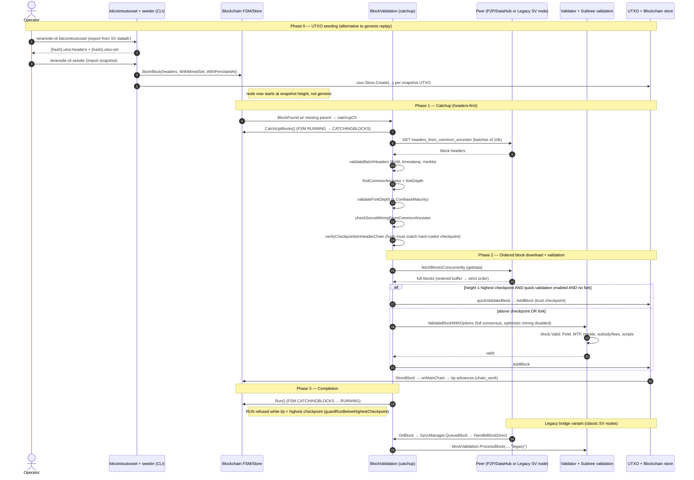

# IBD-1 / FR-4 — Historical Chain Validation Evidence (Code-Level)

> **Status:** DRAFT for reviewer sign-off. This document is research + evidence only. It is **not** a substitute
> for a BSVA audit report — it is the code-grounded basis a reviewer can cite when deciding the IBD-1 / FR-4
> override (`--reviewer-overrides`).

**Prepared for:** the two documentation-review rows that cap the acceptance verdict at `INCOMPLETE`:
- **IBD-1** — "Historical Validation Evidence Review" (`TCExcludedDocumentation`, **critical**)
- **FR-4** — "Historical Chain Validation Evidence" (`CoverageDocumentationReview`, **DEFERRED**)

**Upstream repository reviewed:** `bsv-blockchain/teranode`
**Reviewed commit SHA:** `3454babf6587752c38551844a40a342155b17d24` (shallow clone, `git rev-parse HEAD`)
**Permalink base:** `https://github.com/bsv-blockchain/teranode/blob/3454babf6587752c38551844a40a342155b17d24/`

> ⚠️ **Version-drift caveat.** This evidence was traced against upstream `main` @ `3454bab`, which is **newer** than
> the image our harness pins (`ghcr.io/bsv-blockchain/teranode:v0.15.0-beta-2`) and the SP2 discovery commit
> (`11f5fa6a…`). The *architecture* (catchup + headers/checkpoints + UTXO seeding + legacy bridge) is stable across
> these, but exact line numbers apply to `3454bab`. A reviewer signing off the pinned image should confirm the
> equivalent code exists in the deployed build.

---

## 1. Scope & honest framing — what "IBD" means in Teranode

**Teranode deliberately does NOT implement classic Initial Block Download to genesis.** The upstream consensus-rules
reference states this explicitly:

> "Given the chain of block headers can be used to adhere to the Genesis Block rules, the Initial Block Download or
> IBD where a new node joining the network downloads all block data including transaction data all the way back to the
> Genesis block used by current node implementations **is not needed and will not be included in the Teranode Node
> system**."

- `docs/references/networkConsensusRules.md` §"Genesis Block Rule", line 44 — [permalink](https://github.com/bsv-blockchain/teranode/blob/3454babf6587752c38551844a40a342155b17d24/docs/references/networkConsensusRules.md#L38-L44)

Instead, the *role* of IBD (bringing a node from "nothing" to "fully validated current tip") is fulfilled by **four
cooperating mechanisms**. This document characterizes each truthfully:

| Mechanism | What it does | Replaces (vs. classic IBD) |
|---|---|---|
| **UTXO-set seeding** (`bitcointoutxoset` → `seeder`) | Imports a UTXO snapshot + full header chain so a node starts at a recent height **without replaying transactions from genesis** | The "replay every historical tx" portion of classic IBD |
| **Catchup** (`services/blockvalidation/catchup.go`) | Headers-first acquisition → common-ancestor → ordered concurrent block download → sequential validation, from the node's tip up to the network tip | The "download + validate forward" loop of classic IBD |
| **Checkpoints / quick validation** | Below the highest hard-coded checkpoint, a fast path trusts checkpoint-guaranteed validity; above it, full consensus validation runs | The "trust nothing, fully verify" stance of classic IBD (relaxed below checkpoints, as SV Node also does) |
| **Legacy P2P bridge** (`services/legacy/`) | Classic BSV wire protocol (`getheaders`/`headers`/`getdata`/`block`) so Teranode can sync historical blocks **directly from SV nodes** | The peer-to-peer block sourcing of classic IBD |

**What this means for FR-4 / IBD-1.** The evidence below substantiates that Teranode **performs and validates
historical block synchronization** — the IBD-equivalent — through code that:
1. acquires and validates the header chain (PoW, timestamp, merkle, continuity),
2. verifies hard-coded checkpoints against that header chain,
3. downloads historical blocks in order from peers (modern P2P/DataHub **and** legacy SV nodes),
4. validates each block (full consensus validation above checkpoints; checkpoint-trusting quick path below),
5. protects against deep reorgs / secret mining, and
6. commits validated blocks so the chain tip advances.

It does **not** substantiate a from-genesis transaction replay, because Teranode intentionally does not do that.
A reviewer must decide whether the headers-first + checkpoint + UTXO-seeding model satisfies the *intent* of FR-4
("historical chain validation"). Section 9 gives a recommended override note framing exactly that.

---

## 2. The IBD-1 / FR-4 criteria this evidence must satisfy

From this repo's own manifest and docs:

**`internal/matrix/manifest.go`**
- **FR-4** (lines 30–35): *"Historical Chain Validation Evidence"*, `CoverageStatus: CoverageDocumentationReview`,
  `CoveredBy: []` — Notes: *"IBD-1 in source plan; not an automated test. Reviewer override required."*
- **IBD-1** (lines 201–207): *"Historical Validation Evidence Review"*, `TCExcludedDocumentation`, `SeverityCritical`,
  `SatisfiesReqs: ["FR-4"]`, ExclusionReason: *"Source plan itself notes this is documentation review, not testing."*
- **R4** (lines 334–339): risk *"Undetected consensus bugs (incomplete historical validation)"*, `CoveredBy: [IBD-1, IBD-2]`,
  Notes: *"IBD-1 documentation review required for full mitigation."*

**`docs/verdict-interpretation.md`** (IBD-1 / FR-4 rows):
- IBD-1 **PASS (via override)** = *"Reviewer confirmed BSVA's IBD validation report covers consensus rule changes for
  the relevant period"* — include artefact reference in the override file.
- FR-4 **PASS (via override)** = *"Reviewer confirmed the same IBD evidence covers FR-4 (historical chain validation)"*;
  *"FR-4 artefact is typically the same as IBD-1."*

**`docs/operator-guide.md`** §5 (Reviewer overrides workflow):
- IBD-1 / FR-4 both require a `--reviewer-overrides` YAML entry with `decision: PASS`, an `artefacts: [...]` list, and a
  `note`. Without it the runner caps the verdict at `INCOMPLETE`.

**Exact bar the evidence must clear (synthesised):**
1. Show **where and how** Teranode validates historical blocks (consensus-rule enforcement).
2. Show coverage of **consensus rule changes for the relevant period** (checkpoints encode this; full validation above
   the highest checkpoint enforces current rules).
3. Be honest about **scope and gaps** so the reviewer's decision (PASS/PASS-with-caveats/FAIL) is well-founded.
4. Supply **artefacts** the override can cite (this doc + the source permalinks below).

---

## 3. Code evidence walkthrough

All permalinks are pinned to `3454babf6587752c38551844a40a342155b17d24`. Snippets are abbreviated; line ranges are exact.

### 3.1 Blockchain FSM and sync-related states

The FSM has **three active states** — `IDLE`, `RUNNING`, `CATCHINGBLOCKS` — and three events (`RUN`, `CATCHUPBLOCKS`,
`STOP`). `LEGACYSYNCING` is **reserved** (a legacy persisted state migrated to `CATCHINGBLOCKS` on init; not a live
transition target).

- **State / event enums:** `services/blockchain/blockchain_api/blockchain_api.proto`
  - `FSMStateType` lines 930–936 — `IDLE=0; RUNNING=1; CATCHINGBLOCKS=2; reserved "LEGACYSYNCING";`
    — [permalink](https://github.com/bsv-blockchain/teranode/blob/3454babf6587752c38551844a40a342155b17d24/services/blockchain/blockchain_api/blockchain_api.proto#L930-L936)
  - `FSMEventType` lines 664–669 — `STOP=0; RUN=1; CATCHUPBLOCKS=2; reserved "LEGACYSYNC";`
    — [permalink](https://github.com/bsv-blockchain/teranode/blob/3454babf6587752c38551844a40a342155b17d24/services/blockchain/blockchain_api/blockchain_api.proto#L664-L669)

- **Transition table (single source of truth):** `services/blockchain/fsm.go` lines 16–38 —
  [permalink](https://github.com/bsv-blockchain/teranode/blob/3454babf6587752c38551844a40a342155b17d24/services/blockchain/fsm.go#L16-L38)

```16:38:services/blockchain/fsm.go
var FSMTransitions = fsm.Events{
	{
		Name: blockchain_api.FSMEventType_RUN.String(),
		Src: []string{
			blockchain_api.FSMStateType_IDLE.String(),
			blockchain_api.FSMStateType_CATCHINGBLOCKS.String(),
		},
		Dst: blockchain_api.FSMStateType_RUNNING.String(),
	},
	{
		Name: blockchain_api.FSMEventType_CATCHUPBLOCKS.String(),
		Src: []string{
			blockchain_api.FSMStateType_RUNNING.String(),
		},
		Dst: blockchain_api.FSMStateType_CATCHINGBLOCKS.String(),
	},
	...
}
```

- **Entering catchup** (`RUNNING → CATCHINGBLOCKS`): `services/blockvalidation/catchup.go` `setFSMCatchingBlocks` lines
  973–983 → calls `blockchainClient.CatchUpBlocks(ctx)`. Server-side: `services/blockchain/Server.go` `CatchUpBlocks`
  lines 2963–2980 (sends `FSMEventType_CATCHUPBLOCKS`, only valid from `RUNNING`) —
  [catchup.go#L973-L983](https://github.com/bsv-blockchain/teranode/blob/3454babf6587752c38551844a40a342155b17d24/services/blockvalidation/catchup.go#L973-L983),
  [Server.go#L2963-L2980](https://github.com/bsv-blockchain/teranode/blob/3454babf6587752c38551844a40a342155b17d24/services/blockchain/Server.go#L2963-L2980)
- **Exiting catchup** (`CATCHINGBLOCKS → RUNNING`): `restoreFSMState` lines 992–1005 → `Run(...)`.
- **RUN gate (deep-sync safety):** a node may not declare itself caught-up (`RUN`) while its tip is **below the highest
  hard-coded checkpoint** (boot `IDLE → RUN` excepted): `services/blockchain/Server.go` `guardRunBelowHighestCheckpoint`
  lines 2897–2922 and `HighestCheckpointHeight` lines 2925–2934 —
  [permalink](https://github.com/bsv-blockchain/teranode/blob/3454babf6587752c38551844a40a342155b17d24/services/blockchain/Server.go#L2897-L2934)

### 3.2 The catchup / block-synchronization process (modern path)

The modern IBD/catchup engine lives in `services/blockvalidation/`. It is triggered when a discovered block has a
missing parent (or, optionally, when the node is far behind and `UseCatchupWhenBehind` is enabled — default `false`).

- **Trigger → channel:** `services/blockvalidation/Server.go`
  - `processBlockFound` (missing parent → enqueue) lines 1379–1401 —
    [permalink](https://github.com/bsv-blockchain/teranode/blob/3454babf6587752c38551844a40a342155b17d24/services/blockvalidation/Server.go#L1379-L1401)
  - `catchupCh` consumer lines 671–682; `processCatchupChItem` lines 1616–1652 (calls `catchupFunc` = `catchup`).
- **Orchestrator:** `services/blockvalidation/catchup.go` `catchup` lines 59–266 — a documented 10-step sequence —
  [permalink](https://github.com/bsv-blockchain/teranode/blob/3454babf6587752c38551844a40a342155b17d24/services/blockvalidation/catchup.go#L59-L266)

```59:71:services/blockvalidation/catchup.go
// catchup orchestrates the complete blockchain synchronization process.
// It follows a clear sequence of steps to safely synchronize with a peer:
//
// 1. Acquire catchup lock (prevent concurrent catchups)
// 2. Fetch headers from peer
// 3. Find and validate common ancestor
// 4. Check coinbase maturity constraints
// 5. Detect secret mining attempts
// 6. Filter headers to process
// 7. Build header chain cache
// 8. Verify chain continuity
// 9. Fetch and validate blocks
// 10. Clean up resources
```

- **Header acquisition (headers-first):** `services/blockvalidation/catchup_get_block_headers.go`
  `catchupGetBlockHeaders` lines 16–33 / 187–425 — iterates `GET .../headers_from_common_ancestor/{tip}` in batches of
  10,000; each batch passes through `validateBatchHeaders` (lines 343–360) —
  [permalink](https://github.com/bsv-blockchain/teranode/blob/3454babf6587752c38551844a40a342155b17d24/services/blockvalidation/catchup_get_block_headers.go#L187-L425)
- **Common ancestor + fork depth:** `catchup.go` `findCommonAncestor` lines 444–528 (walks peer headers oldest→newest,
  stops at first unknown block, rejects ancestors above the UTXO height, computes `forkDepth`) —
  [permalink](https://github.com/bsv-blockchain/teranode/blob/3454babf6587752c38551844a40a342155b17d24/services/blockvalidation/catchup.go#L444-L528)
- **Ordered, concurrent block download + sequential validation:**
  - `fetchAndValidateBlocks` lines 793–859 — `errgroup`: `fetchBlocksConcurrently` ∥ `validateBlocksOnChannel`.
  - `services/blockvalidation/get_blocks.go` `fetchBlocksConcurrently` lines 51–108 (batch fetch → worker pool →
    ordered buffer) and `orderedDelivery` lines 291–346 (delivers blocks **in strict index order**) —
    [permalink](https://github.com/bsv-blockchain/teranode/blob/3454babf6587752c38551844a40a342155b17d24/services/blockvalidation/get_blocks.go#L291-L346)
  - `validateBlocksOnChannel` lines 1020–1109 — for each ordered block: `tryQuickValidation` (if eligible) else
    `ValidateBlockWithOptions(..., IsCatchupMode: true, DisableOptimisticMining: true)` —
    [permalink](https://github.com/bsv-blockchain/teranode/blob/3454babf6587752c38551844a40a342155b17d24/services/blockvalidation/catchup.go#L1020-L1109)

### 3.3 Block validation path (synced / historical blocks)

- **Full validation entrypoint:** `services/blockvalidation/BlockValidation.go`
  - `ValidateBlock` lines 1217–1223 (thin wrapper) → `ValidateBlockWithOptions` lines 1237–1748 (full pipeline) —
    [permalink](https://github.com/bsv-blockchain/teranode/blob/3454babf6587752c38551844a40a342155b17d24/services/blockvalidation/BlockValidation.go#L1237-L1748)
  - Pipeline stages: block-size + coinbase checks (L1299–1330) → subtree/tx validation (L1402–1427, delegates to
    `subtreevalidation.CheckBlockSubtrees`) → difficulty/PoW (L1440–1478) → full consensus `block.Valid(...)`
    (L1614–1646, non-optimistic path) → `AddBlock` commit (L1662–1696).
- **Consensus core:** `model/Block.go` `Block.Valid` lines 406–598 enforces: PoW/target, future-timestamp bound,
  **median-time-past** over the last ≤11 headers, coinbase validity + height, subtree/coinbase-placeholder checks,
  **merkle root**, **block subsidy / fee** limits, duplicate-tx detection, and tx order + per-script validation
  (`validOrderAndBlessed`) —
  [permalink](https://github.com/bsv-blockchain/teranode/blob/3454babf6587752c38551844a40a342155b17d24/model/Block.go#L406-L598)
- **Subtree (tx-level) validation:** `services/subtreevalidation/check_block_subtrees.go` `CheckBlockSubtrees`
  lines 53–78 (validates each subtree's scripts/consensus via the validator service) —
  [permalink](https://github.com/bsv-blockchain/teranode/blob/3454babf6587752c38551844a40a342155b17d24/services/subtreevalidation/check_block_subtrees.go#L53-L78)

### 3.4 Legacy service / P2P bridge to classic BSV nodes

The legacy service speaks the classic BSV wire protocol so Teranode can receive historical blocks directly from SV
nodes. There is no separate `blockmanager` package — sync is `netsync.SyncManager`.

- **Wire handlers registered:** `services/legacy/peer_server.go` `newPeerConfig` lines 2433–2477 (`OnBlock`, `OnInv`,
  `OnHeaders`, `OnGetData`, `OnGetHeaders`) — [permalink](https://github.com/bsv-blockchain/teranode/blob/3454babf6587752c38551844a40a342155b17d24/services/legacy/peer_server.go#L2433-L2477)
- **Inbound historical block:** `serverPeer.OnBlock` lines 910–995 → `syncManager.QueueBlock(...)` (blocks the peer
  read loop until the block is processed — backpressure) —
  [permalink](https://github.com/bsv-blockchain/teranode/blob/3454babf6587752c38551844a40a342155b17d24/services/legacy/peer_server.go#L910-L995)
- **Headers-first responses:** `serverPeer.OnHeaders` lines 1045–1053 → `QueueHeaders`.
- **Sync manager start / loop:** `services/legacy/netsync/manager.go`
  - `startSync` lines 529–706 — sends `getheaders` to the next checkpoint hash and enters **headers-first** mode when
    checkpoints are enabled and the tip is below the next checkpoint (not on regtest); otherwise classic `getblocks`.
    If >10 blocks behind it calls `blockchainClient.CatchUpBlocks()` (drives FSM `CATCHINGBLOCKS`) —
    [permalink](https://github.com/bsv-blockchain/teranode/blob/3454babf6587752c38551844a40a342155b17d24/services/legacy/netsync/manager.go#L529-L706)
  - `handleHeadersMsg` lines 1649–1797 — validates header linkage and **disconnects peers whose checkpoint-height
    header hash does not match** the hard-coded checkpoint.
  - `fetchHeaderBlocks` lines 1562–1647 — issues `getdata` for the header-listed blocks.
- **Handoff into Teranode validation:** `services/legacy/netsync/handle_block.go`
  - `HandleBlockDirect` lines 39–237 — builds subtrees, checks PoW (`HasMetTargetDifficulty`), then `ProcessBlock`.
  - `ProcessBlock` lines 266–295 → `blockValidation.ProcessBlock(..., "legacy", ...)` —
    [permalink](https://github.com/bsv-blockchain/teranode/blob/3454babf6587752c38551844a40a342155b17d24/services/legacy/netsync/handle_block.go#L266-L295)
  - Legacy checkpoint quick path: `quickValidationAllowed` lines 487–506 (skips full subtree re-validation at/below the
    highest checkpoint).
- **Peer config (dial classic SV nodes):** `settings/legacy_settings.go` `ConnectPeers` line 12 (key
  `legacy_connect_peers`); applied in `services/legacy/peer_server.go` lines 3304–3401 — when set, the node connects
  **only** to the listed peers (DNS seeding disabled), the canonical IBD-from-SV-node setup —
  [permalink](https://github.com/bsv-blockchain/teranode/blob/3454babf6587752c38551844a40a342155b17d24/services/legacy/peer_server.go#L3304-L3401)

### 3.5 UTXO-set seeding / snapshot import (the alternative to genesis replay)

- **Export from a legacy SV/bitcoind data dir:** `cmd/bitcointoutxoset/bitcoin_to_utxo_set.go`
  `ConvertBitcoinToUtxoSet` lines 72–101 — reads `chainstate` + `blocks/index` LevelDB, writes `{hash}.utxo-set`
  (L218) and `{hash}.utxo-headers` (`cmd/bitcointoutxoset/bitcoin/headers.go` L210) —
  [permalink](https://github.com/bsv-blockchain/teranode/blob/3454babf6587752c38551844a40a342155b17d24/cmd/bitcointoutxoset/bitcoin_to_utxo_set.go#L72-L101)
- **Import into Teranode:** `cmd/seeder/seeder.go` `Seeder` lines 71–195 (concurrent header + UTXO import)
  - `processHeaders` lines 200–323 — bulk-imports the header chain via `blockchainStore.StoreBlock(..., "headers",
    WithMinedSet(true), WithSubtreesSet(true), WithPersistedAt())` (uses the `seeder=true` bulk-import DB
    optimization) — [permalink](https://github.com/bsv-blockchain/teranode/blob/3454babf6587752c38551844a40a342155b17d24/cmd/seeder/seeder.go#L200-L323)
  - `processUTXOs` lines 326–500 → `processUTXO` lines 526–566 — streams the snapshot and calls `utxo.Store.Create(...)`
    per transaction.
- **CLI wiring:** `cmd/teranodecli/teranodecli/cli.go` lines 208–255 (`seeder` / `bitcointoutxoset` subcommands).
- **In-repo docs confirming the model:** `docs/topics/commands/seeder.md` lines 16–26 ("populate the UTXO store with
  data up to and including a specific block… reads a UTXO set produced by the UTXO Persister"); operator how-to
  `docs/howto/miners/docker/minersHowToSyncTheNode.md` lines 10–48 ("Seed from a Snapshot… speed up UTXO
  initialization"); `docs/howto/miners/systemRequirements.md` line 28 (full genesis sync is the non-default
  alternative *to* seeding).

**`utxopersister` (produces the snapshots that `seeder` consumes):** `services/utxopersister/UTXOSet.go` package doc
lines 1–4 and `CreateUTXOSet` lines 500–584 — applies per-block utxo-additions/deletions diffs (from `blockpersister`)
onto the previous block's `.utxo-set` to roll a complete snapshot forward (waits 100 confirmations behind tip) —
[permalink](https://github.com/bsv-blockchain/teranode/blob/3454babf6587752c38551844a40a342155b17d24/services/utxopersister/UTXOSet.go#L500-L584)

### 3.6 Where the chain tip advances / validated blocks are committed

There is **no explicit `setChainTip` pointer**. The tip is *derived* as the highest-`chain_work` valid row in the
`blocks` table; a validated block becomes the tip when it is stored as a chain extension.

- **Commit call:** validated blocks → `blockchainClient.AddBlock(...)`
  - Full path: `services/blockvalidation/BlockValidation.go` lines 1662–1696.
  - Quick path: `services/blockvalidation/quick_validate.go` lines 230–238.
- **Service → store:** `services/blockchain/Server.go` `AddBlock` lines 1008–1100 → `store.StoreBlock(...)`.
- **SQL commit + implicit tip:** `stores/blockchain/sql/StoreBlock.go` `StoreBlock` lines 96–213 — computes
  `onMainChain` (new block extends current best), assigns `height = parent + 1`, and on the fast path CAS-updates the
  cached best-block id so **the new block IS the tip**; reorg/fork cases go through `reconcileOnMainChain` —
  [permalink](https://github.com/bsv-blockchain/teranode/blob/3454babf6587752c38551844a40a342155b17d24/stores/blockchain/sql/StoreBlock.go#L96-L213)
- **Tip read:** `stores/blockchain/sql/GetBestBlockHeader.go` lines 42–137 —
  `... WHERE invalid = false ORDER BY chain_work DESC, peer_id ASC, id ASC LIMIT 1` —
  [permalink](https://github.com/bsv-blockchain/teranode/blob/3454babf6587752c38551844a40a342155b17d24/stores/blockchain/sql/GetBestBlockHeader.go#L42-L137)
- **Block blob persistence (separate concern):** `services/blockpersister/Server.go` → `persistBlock` →
  `SetBlockPersistedAt` (`stores/blockchain/sql/SetBlockPersistedAt.go` lines 11–31). Note `SetBlockProcessedAt` is a
  block-assembly marker, **not** tip advancement.

---

## 4. Sequence diagram — end-to-end sync / IBD-equivalent flow



---

## 5. Supporting information

### 5.1 Consensus-rule enforcement points (summary)

| Rule | Where enforced | Permalink |
|---|---|---|
| PoW / target (headers) | `catchup/header_validation.go` `ValidateHeaderProofOfWork` L13–26 | [link](https://github.com/bsv-blockchain/teranode/blob/3454babf6587752c38551844a40a342155b17d24/services/blockvalidation/catchup/header_validation.go#L13-L26) |
| Timestamp bound (headers) | `ValidateHeaderTimestamp` L47–71 | [link](https://github.com/bsv-blockchain/teranode/blob/3454babf6587752c38551844a40a342155b17d24/services/blockvalidation/catchup/header_validation.go#L47-L71) |
| PoW / target (block) | `BlockValidation.go` L1440–1478 + `model/Block.go` `Valid` | [link](https://github.com/bsv-blockchain/teranode/blob/3454babf6587752c38551844a40a342155b17d24/services/blockvalidation/BlockValidation.go#L1440-L1478) |
| Median-time-past | `model/Block.go` `Valid` L406–598 | [link](https://github.com/bsv-blockchain/teranode/blob/3454babf6587752c38551844a40a342155b17d24/model/Block.go#L406-L598) |
| Merkle root | `model/Block.go` `Valid` (CheckMerkleRoot) | (same) |
| Block subsidy / fees | `model/Block.go` `Valid` | (same) |
| Coinbase validity + height | `model/Block.go` `Valid` | (same) |
| Script / tx consensus | `subtreevalidation/check_block_subtrees.go` `CheckBlockSubtrees` L53–78 → validator | [link](https://github.com/bsv-blockchain/teranode/blob/3454babf6587752c38551844a40a342155b17d24/services/subtreevalidation/check_block_subtrees.go#L53-L78) |

### 5.2 Checkpoint handling

- Checkpoints come from `chaincfg.Params.Checkpoints` (e.g. `MainNetParams`).
- **Catchup verifies them against the fetched header chain before trusting any block:**
  `catchup.go` `verifyCheckpointsInHeaderChain` lines 660–697 and `verifyCheckpointsAgainstHeaders` lines 709–748 (hash
  mismatch → `CHECKPOINT VERIFICATION FAILED`, abort) —
  [permalink](https://github.com/bsv-blockchain/teranode/blob/3454babf6587752c38551844a40a342155b17d24/services/blockvalidation/catchup.go#L660-L748)
- **Legacy path** disconnects peers presenting a wrong checkpoint-height header
  (`netsync/manager.go` `handleHeadersMsg`).
- **FSM RUN gate** prevents declaring "caught up" below the highest checkpoint (`Server.go` L2897–2934).

### 5.3 Reorg / deep-reorg protection

- **Fork depth vs. coinbase maturity:** `catchup.go` `validateForkDepth` lines 539–564 — rejects when
  `forkDepth > CoinbaseMaturity` (strict `>`, issue #4592 rationale) —
  [permalink](https://github.com/bsv-blockchain/teranode/blob/3454babf6587752c38551844a40a342155b17d24/services/blockvalidation/catchup.go#L539-L564)

```539:560:services/blockvalidation/catchup.go
func (u *Server) validateForkDepth(catchupCtx *CatchupContext) error {
	...
	if catchupCtx.forkDepth > uint32(u.settings.ChainCfgParams.CoinbaseMaturity) {
		...
		u.recordMaliciousAttempt(catchupCtx.peerID, "coinbase_maturity_violation")
		...
		return errors.NewServiceError("[catchup][%s] fork depth (%d) exceeds coinbase maturity (%d)", ...)
	}
	...
}
```

- **Secret-mining detection:** `catchup.go` `checkSecretMiningFromCommonAncestor` lines 1204–1241 — rejects when
  `blocksBehind > SecretMiningThreshold` (default `CoinbaseMaturity-1`, i.e. 99 on mainnet). **Honest note:** automatic
  peer banning on this condition is logged as *"not yet implemented"* (L1238–1239).
- **No symbol named `maxReorgDepth` / `deepReorg`** exists in these packages — deep-reorg protection is the combination
  of (a) fork-depth ≤ coinbase maturity, (b) secret-mining threshold, and (c) the FSM RUN gate below the highest
  checkpoint.

### 5.4 Config flags that affect historical validation

| Setting | Key | Default | Effect |
|---|---|---|---|
| Quick (checkpoint) validation | `blockvalidation_catchup_allow_quick_validation` | **`true`** (`settings/settings.go` L367) | Below highest checkpoint + no fork, blocks are committed via the checkpoint-trusting quick path (no `block.Valid` / script re-validation) |
| Optimistic mining | `blockvalidation_optimistic_mining` | **`true`** (L340) globally, but **disabled during catchup** (`DisableOptimisticMining: true`, catchup.go L1061–1065) | Live blocks may be added before full validation completes; catchup does not use this |
| Catchup-when-behind | `blockvalidation_useCatchupWhenBehind` | **`false`** (L358) | Most catchups are missing-parent-driven, not queue-depth-driven |
| Secret-mining threshold | `blockvalidation_secret_mining_threshold` | `CoinbaseMaturity-1` (L351) | Reorg-depth ceiling for catchup |
| Legacy connect peers | `legacy_connect_peers` | empty | When set, sync exclusively from listed SV nodes |
| Disable checkpoints | `--nocheckpoints` (legacy) | off | Would disable headers-first/quick-validation gating in the legacy path |

> **Key implication for the reviewer:** with defaults, **blocks at or below the highest hard-coded checkpoint are
> committed via the quick path** — Teranode trusts the checkpoint rather than re-executing every historical script. This
> matches the project's stated design (and is analogous to SV Node's `assumevalid`/checkpoint behaviour), but it means
> "historical validation" below the highest checkpoint is **checkpoint-anchored**, not a full from-scratch re-validation.
> Blocks **above** the highest checkpoint, and **any fork**, always take the full consensus path.

---

## 6. Sign-off assessment

### 6.1 Evidence → criteria mapping

| Criterion (from §2) | Evidenced by code? | Where |
|---|---|---|
| Teranode validates historical blocks (consensus enforcement) | **Yes** | §3.2–3.3, §5.1 — `catchup` → `ValidateBlockWithOptions` → `model.Block.Valid` (PoW, MTP, merkle, subsidy, scripts) |
| Covers consensus-rule changes for the relevant period | **Yes (mechanism)** | §5.2 — checkpoints verified against header chain; full validation above highest checkpoint enforces current rules |
| Historical block *acquisition* from peers (incl. classic BSV) | **Yes** | §3.4 — legacy `getheaders/headers/getdata/block`; §3.2 modern headers-first catchup |
| Alternative to genesis replay (so "historical state" is established) | **Yes** | §3.5 — `bitcointoutxoset` → `seeder` UTXO+header import |
| Tip advances on validated blocks | **Yes** | §3.6 — `AddBlock` → `StoreBlock` → `chain_work` tip |
| Deep-reorg / consensus-attack protection | **Yes (partial)** | §5.3 — fork-depth + secret-mining + RUN gate; peer-ban not yet implemented |
| From-genesis full transaction replay | **No (by design)** | §1 — explicitly excluded in `networkConsensusRules.md` |

### 6.2 Verdict: **PARTIAL — sufficient with caveats**

The upstream code **does substantiate** that Teranode performs and validates historical block synchronization (the
IBD-equivalent): there is a real, ordered, peer-driven block-download loop; real header validation; checkpoint
verification; full consensus validation (`model.Block.Valid`) above checkpoints and on forks; deep-reorg guards; and a
real tip-advance commit path. The "no genesis IBD" stance is **intentional and documented**, and the UTXO-seeding +
catchup + checkpoint design is a coherent, code-backed substitute.

**Residual gaps a reviewer should explicitly note before signing PASS:**
1. **Checkpoint-anchored, not full re-validation below the highest checkpoint.** With `CatchupAllowQuickValidation=true`
   (default), sub-checkpoint blocks are committed by trusting the checkpoint; difficulty checks are also skipped at/below
   checkpoint height (`BlockValidation.go` L1440–1447). This is normal for production BSV/BTC nodes but should be stated.
2. **No formal BSVA results/audit report is embodied in code.** This document is *code evidence of capability*, not a
   *run/audit attestation* that a specific historical range was validated on mainnet. IBD-1/FR-4 as written ask the
   reviewer to confirm a BSVA IBD **report** — that artefact still needs to be supplied or explicitly waived.
3. **Version drift.** Evidence is from `main @ 3454bab`; the harness pins `v0.15.0-beta-2`. Confirm equivalence for the
   deployed build.
4. **Secret-mining peer banning not implemented** (detection only).
5. **Harness IBD coverage is regtest/synthetic** (IBD-2 fixtures are synthetic regtest txs verifying *parity*, not a
   mainnet historical replay) — so the automated suite does not itself exercise mainnet historical validation.

### 6.3 Recommended reviewer override note + artefacts

Suggested `--reviewer-overrides` entries (adapt reviewer identity / decision to BSVA's judgement):

```yaml
overrides:
  IBD-1:
    decision: PASS   # or PASS pending the BSVA audit artefact — reviewer's call
    artefacts:
      - "docs/ibd-fr4-evidence.md"
      - "https://github.com/bsv-blockchain/teranode/blob/3454babf6587752c38551844a40a342155b17d24/docs/references/networkConsensusRules.md#L38-L44"
      - "https://github.com/bsv-blockchain/teranode/blob/3454babf6587752c38551844a40a342155b17d24/services/blockvalidation/catchup.go#L59-L266"
      - "https://github.com/bsv-blockchain/teranode/blob/3454babf6587752c38551844a40a342155b17d24/services/blockvalidation/BlockValidation.go#L1237-L1748"
      - "https://github.com/bsv-blockchain/teranode/blob/3454babf6587752c38551844a40a342155b17d24/model/Block.go#L406-L598"
    note: >
      Code-level review (commit 3454bab) confirms Teranode performs the IBD-equivalent: headers-first catchup
      (services/blockvalidation/catchup.go) with PoW/timestamp/merkle header validation, hard-coded checkpoint
      verification, ordered concurrent block download, and full consensus validation (model.Block.Valid) above the
      highest checkpoint and on all forks; deep-reorg protection via fork-depth<=coinbase-maturity and secret-mining
      thresholds; UTXO-set seeding (bitcointoutxoset->seeder) as the documented, intentional substitute for
      genesis replay. Caveats: sub-checkpoint blocks use the checkpoint-trusting quick path (default on); evidence is
      capability-level from source, not a mainnet run attestation.
  FR-4:
    decision: PASS
    artefacts: ["docs/ibd-fr4-evidence.md"]
    note: "Same code evidence as IBD-1 covers FR-4 historical chain validation scope (see docs/ibd-fr4-evidence.md)."
```

> If BSVA requires a *run/audit* attestation (not just capability evidence), the reviewer should mark IBD-1/FR-4 PASS
> **only** alongside the BSVA IBD report artefact, or keep them open and request that report. This document gives the
> reviewer the code basis either way.

---

## 7. Appendix — primary source index (pinned to `3454bab`)

| Topic | File | Symbol | Lines |
|---|---|---|---|
| No-genesis-IBD policy | `docs/references/networkConsensusRules.md` | Genesis Block Rule | 38–44 |
| FSM transitions | `services/blockchain/fsm.go` | `FSMTransitions` | 16–38 |
| FSM enums | `services/blockchain/blockchain_api/blockchain_api.proto` | `FSMStateType` / `FSMEventType` | 930–936 / 664–669 |
| RUN gate | `services/blockchain/Server.go` | `guardRunBelowHighestCheckpoint` | 2897–2934 |
| Catchup orchestrator | `services/blockvalidation/catchup.go` | `catchup` | 59–266 |
| Header fetch | `services/blockvalidation/catchup_get_block_headers.go` | `catchupGetBlockHeaders` | 187–425 |
| Common ancestor | `services/blockvalidation/catchup.go` | `findCommonAncestor` | 444–528 |
| Ordered download | `services/blockvalidation/get_blocks.go` | `fetchBlocksConcurrently` / `orderedDelivery` | 51–108 / 291–346 |
| Catchup validate loop | `services/blockvalidation/catchup.go` | `validateBlocksOnChannel` | 1020–1109 |
| Full block validation | `services/blockvalidation/BlockValidation.go` | `ValidateBlockWithOptions` | 1237–1748 |
| Consensus core | `model/Block.go` | `Block.Valid` | 406–598 |
| Subtree/script validation | `services/subtreevalidation/check_block_subtrees.go` | `CheckBlockSubtrees` | 53–78 |
| Checkpoint verify | `services/blockvalidation/catchup.go` | `verifyCheckpointsInHeaderChain` | 660–748 |
| Quick validation | `services/blockvalidation/quick_validate.go` | `quickValidateBlock` | 189–260 |
| Fork-depth guard | `services/blockvalidation/catchup.go` | `validateForkDepth` | 539–564 |
| Secret-mining guard | `services/blockvalidation/catchup.go` | `checkSecretMiningFromCommonAncestor` | 1204–1241 |
| Legacy wire handlers | `services/legacy/peer_server.go` | `newPeerConfig` / `OnBlock` | 2433–2477 / 910–995 |
| Legacy sync manager | `services/legacy/netsync/manager.go` | `startSync` / `handleHeadersMsg` | 529–706 / 1649–1797 |
| Legacy handoff | `services/legacy/netsync/handle_block.go` | `HandleBlockDirect` / `ProcessBlock` | 39–237 / 266–295 |
| UTXO export | `cmd/bitcointoutxoset/bitcoin_to_utxo_set.go` | `ConvertBitcoinToUtxoSet` | 72–101 |
| UTXO import | `cmd/seeder/seeder.go` | `Seeder` / `processHeaders` / `processUTXOs` | 71–195 / 200–323 / 326–500 |
| UTXO snapshot rollup | `services/utxopersister/UTXOSet.go` | `CreateUTXOSet` | 500–584 |
| Tip commit | `stores/blockchain/sql/StoreBlock.go` | `StoreBlock` | 96–213 |
| Tip read | `stores/blockchain/sql/GetBestBlockHeader.go` | `GetBestBlockHeader` | 42–137 |

**Settings defaults referenced:** `settings/settings.go` — `OptimisticMining` L340, `SecretMiningThreshold` L351,
`UseCatchupWhenBehind` L358, `CatchupAllowQuickValidation` L367.
